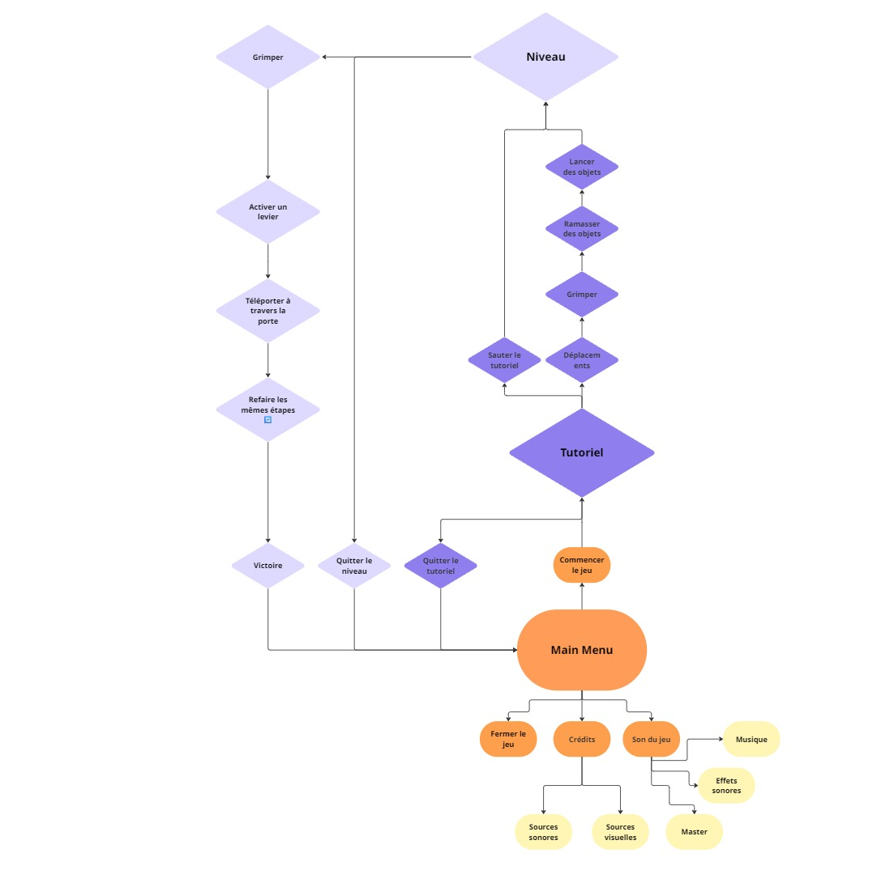

# Bienvenue dans notre répertoire!

Voici le répertoire Github pour le travail personel 3 en réalité mixte (Collège Montmorency H26). 

Ce répertoire contient le projet unity et les médias de la conceptualisation du projet et du projet " L'ASCENSION ".

Ce travail a été fait par Nicolas Cruz, Alexandre Plante-Salmeron et  Félix Lévesque. Ce projet a été fait avec Unity (2022.3.62f3).

### Description du projet

#### L'ASCENSION

Un aventurier se promène dans une forêt. Tout à coup, il fait une chute dans un gouffre proche d'une mine. Il se retrouve piégé au plus profond d'une grotte magique et inexplorée.
Son seul espoir de survie : traverser ce lieu rempli de mystères pour regagner la surface.

C'est un jeu de type puzzle, platformer, VR et first person. Ce jeux est inspiré par le jeu "Only up". Le joueur peut perdre de la progression s'il tombe en bas. Il y a aussi un objet ramassable pour se téléporter contrairement à "Only up".

### MoodBoard visuel

### MoodBoard sonore
https://pixabay.com/sound-effects/film-special-effects-old-mine-ambience-200677/

https://pixabay.com/sound-effects/nature-dripping-water-in-cave-114694/

https://pixabay.com/sound-effects/film-special-effects-wind-chime-melodic-325259/

https://pixabay.com/sound-effects/film-special-effects-transition-futuristic-teleport-121420/

### Carte Environnementale

### Schéma d'Intéractivité

### Distribution des tâches

Alexandre: Niveau, Cinématique

Nicolas: Niveau, Intéractivité

Félix: Niveau, Sons, Designer
